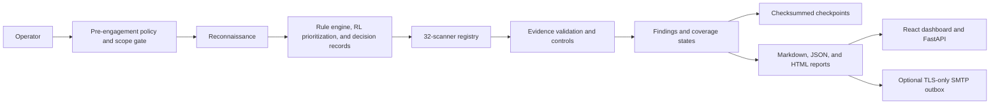

# Agent-Hunter

Agent-Hunter is an evidence-calibrated security assessment agent for authorized web application and API testing. It combines scoped reconnaissance, a 32-scanner registry, policy-aware orchestration, bounded active checks, explicit evidence states, recoverable execution, reporting, and a React/FastAPI operations interface.

> [!IMPORTANT]
> Use Agent-Hunter only on systems you own or have explicit written authorization to test. A public bug-bounty program authorizes only the assets, techniques, traffic levels, and time windows stated in its current rules. Never treat a company name, wildcard guess, or third-party dependency as permission.

## Screenshots

### Reconnaissance dashboard


### FastAPI/OpenAPI interface


## What Agent-Hunter does

- Runs a staged workflow: pre-engagement checks, reconnaissance, strategy, scanning, validation, reflection, and reporting.
- Enforces target scope and policy decisions before and during active requests.
- Registers 32 scanners covering web, API, authentication, authorization, session, transport, configuration, and reconnaissance risks.
- Separates observations, suspicions, confirmed findings, refuted hypotheses, unresolved cases, and untested coverage.
- Maintains independent coverage states so “no finding” is not confused with “fully tested.”
- Uses checksummed checkpoints and last-known-good recovery for interrupted scans.
- Exposes a local FastAPI service with Server-Sent Events and a React operations dashboard.
- Generates Markdown, JSON, and HTML reports with redacted evidence.
- Supports optional outbound-only SMTP report delivery through a durable outbox.
- Uses reinforcement-learning signals to help prioritize modules. RL choices are strategy hints, not vulnerability proof.

## Architecture



The decision engine decides what is reasonable to attempt within policy. Individual scanners produce evidence, validators apply controls, and the reporter preserves the evidence and coverage status. Ambiguous results and cleanup failures escalate rather than being silently promoted to confirmed vulnerabilities.

See [Architecture.md](Architecture.md) for the detailed component map.

## Scanner coverage

The scanner registry includes these major groups:

- **Injection:** SQL injection, server-side template injection, command injection, CRLF injection, XXE, and XSS.
- **Authorization:** IDOR, broken access control, two-identity BOLA checks, and gated mass-assignment checks.
- **Authentication and sessions:** authentication behavior, JWT checks, cookie metadata, CSRF, and rate-limit behavior.
- **Modern APIs and protocols:** OpenAPI 3 discovery, GraphQL, OAuth/OIDC metadata and flow controls, WebSocket authorization, and authenticated-cache behavior.
- **Server-side request and routing:** SSRF, host-header handling, open redirects, and bounded redirect validation.
- **Files and paths:** path traversal and LFI/RFI checks.
- **Configuration and transport:** security headers, CORS, sensitive-data exposure, TLS/SSL, takeover indicators, and general configuration checks.
- **Concurrency:** bounded race-condition checks.

High-impact checks are deliberately constrained:

- BOLA confirmation requires two explicitly configured synthetic identities and stable semantic object identifiers.
- Mass assignment is disabled by default and requires explicit permission, an approved field, operator confirmation, an idempotency key, verification, and cleanup.
- Authenticated-cache checks require controlled identities and prime/probe controls.
- WebSocket testing has connection/message limits, closes its connections, blocks redirects, and enforces scope.
- OpenAPI discovery blocks external references and out-of-scope servers.
- OAuth active-flow checks require an approved synthetic client and in-scope endpoints.

## Evidence and coverage model

Finding evidence states:

- `observed`: a security-relevant property was seen, without proof of exploitability.
- `suspected`: evidence indicates a possible vulnerability but confirmation controls are incomplete.
- `confirmed`: the scanner’s declared validator and controls support the conclusion.
- `refuted`: a control or follow-up disproved the hypothesis.
- `unresolved`: execution ended without enough evidence for a conclusion.
- `not_tested`: the check was not performed.

Coverage states:

- `tested`
- `not_applicable`
- `blocked`
- `deferred`
- `failed`
- `not_tested`

Response changes, status differences, reflection, or body-length differences are not automatically treated as proof.

## Requirements

The project was locally verified with:

- Python 3.12
- Node.js 22
- npm 10
- Windows PowerShell

Other current platforms may work, but those combinations were not verified in the acceptance run.

## Quick start

The project is published through two synchronized GitHub repositories. Clone either location:

```powershell
git clone https://github.com/Anantha-236/Agent-Hunter.git
Set-Location Agent-Hunter
```

or:

```powershell
git clone https://github.com/Hunter-The-Pentester/Hunter-The-Pentester.git
Set-Location Hunter-The-Pentester
```

Create an isolated Python environment:

```powershell
python -m venv .venv
.\.venv\Scripts\Activate.ps1
```

Start the backend and dashboard:

```powershell
python startservers.py
```

The launcher installs `requirements.txt` and the dashboard packages on its first run. When dependencies are already installed:

```powershell
python startservers.py --skip-python-install --skip-dashboard-install
```

Open:

- Dashboard: <http://localhost:5173>
- API documentation: <http://localhost:8888/docs>

Press `Ctrl+C` in the launcher terminal to stop services started by the launcher.

### Manual startup

Backend:

```powershell
python -m pip install -r requirements.txt
python -m uvicorn api_server:app --host 127.0.0.1 --port 8888 --reload
```

Dashboard, in another terminal:

```powershell
Set-Location dashboard
npm.cmd install
npm.cmd run dev
```

## Run a local authorized scan

Start an application you own on `127.0.0.1:8000`, then run:

```powershell
python main.py `
  --target http://127.0.0.1:8000 `
  --scope 127.0.0.1 `
  --yes `
  --no-tui `
  --no-ai `
  --no-memory
```

This example intentionally targets localhost and disables AI and persistent learning. It does not authorize testing any external service.

For a non-local authorized assessment:

1. Copy the examples under `data/` into a new policy/checklist file.
2. Replace every fictional value with the program’s current official scope and rules.
3. Confirm whether automation, authenticated testing, account creation, concurrency testing, and rate-limit testing are permitted.
4. Set a request rate below the program’s maximum.
5. Review all exclusions and third-party assets.
6. Run passive discovery first.
7. Review evidence manually before escalating a suspected result or submitting a report.

The included Acme files are fictional examples and must never be used unchanged against a real target.

## API

The local API includes:

| Method | Route | Purpose |
|---|---|---|
| `POST` | `/api/recon` | Start reconnaissance |
| `GET` | `/api/recon/{recon_id}` | Read reconnaissance state |
| `GET` | `/api/recon/{recon_id}/stream` | Stream reconnaissance events |
| `POST` | `/api/scan` | Start a scan |
| `GET` | `/api/scan/active` | Read the active scan |
| `GET` | `/api/scan/{scan_id}` | Read scan state |
| `GET` | `/api/scan/{scan_id}/findings` | Read findings |
| `GET` | `/api/scan/{scan_id}/report` | Read the generated report |
| `GET` | `/api/scan/{scan_id}/stream` | Stream scan events |
| `POST` | `/api/scan/{scan_id}/pause` | Pause a running scan |
| `POST` | `/api/scan/{scan_id}/abort` | Abort a running scan |
| `GET` | `/api/scanners` | List scanner capabilities |
| `GET` | `/api/settings` | Read local settings |
| `PUT` | `/api/settings` | Update local settings |
| `POST` | `/api/reports/{report_id}/email` | Explicitly queue/deliver a known report |

Interactive API schemas and request examples are available at `/docs` while the backend is running.

## Checkpoints and recovery

Interrupted scans are stored under:

```text
reports/checkpoints/<scan-id>/checkpoint.json
```

Checkpoints are versioned and checksummed. Resume requires a matching target and policy snapshot. If the active checkpoint is corrupt, the orchestrator may recover the newest valid last-known-good backup. An unfinished non-idempotent action is not replayed automatically; it is escalated for human review.

Runtime reports, databases, caches, secrets, and checkpoints are ignored by Git.

## Outbound report email

Email is outbound-only and opt-in. Normal scans and report generation do not contact an SMTP server. Agent-Hunter does not read inboxes, retrieve OTPs, solve MFA/CAPTCHAs, sign in to Bugcrowd or HackerOne, or submit reports automatically.

Copy the empty keys from `.env.local.example` into an ignored `.env.local`:

```text
SMTP_HOST=smtp.provider.example
SMTP_PORT=587
SMTP_USERNAME=your-smtp-username
SMTP_PASSWORD=your-new-app-password
SMTP_STARTTLS=true
SMTP_REPORT_FROM=your-verified-sender@example.com
SMTP_REPORT_TO=your-allowed-recipient@example.com
SMTP_RECIPIENT_ALLOWLIST=your-allowed-recipient@example.com
SMTP_MAX_ATTACHMENT_BYTES=5242880
HUNTER_LOCAL_API_TOKEN=a-long-random-local-token
```

`SMTP_STARTTLS` must be true. Recipient addresses must be allowlisted. Oversized, non-UTF-8, or insufficiently redacted reports are rejected before entering the outbox.

Send the redacted JSON report after an authorized CLI scan:

```powershell
python main.py --target http://127.0.0.1:8000 --scope 127.0.0.1 --yes --email-report
```

Retry due outbound messages:

```powershell
python main.py --retry-email-outbox
```

Delivered messages and messages marked `delivery_unknown` are not automatically resent.

Never commit a real SMTP password, token, cookie, authorization header, OTP, request body, or user-submitted form value. If a credential has appeared in chat, logs, terminal history, or a committed file, revoke it and create a new one.

## Testing

Install the development dependencies:

```powershell
python -m pip install -r requirements-dev.txt
```

Run the complete Python suite:

```powershell
python -m pytest -q
```

Build the dashboard:

```powershell
Set-Location dashboard
npm.cmd ci
npm.cmd run build
```

The RL-specific commands are documented in [CI_README.md](CI_README.md).

## Verified status

Local verification on 2026-09-24 established:

| Area | Result |
|---|---|
| Python suite | 330 tests passed |
| Scanner registry | 32 scanners initialized |
| Dashboard production build | Passed |
| Local API startup | HTTP 200 verified |
| Local dashboard startup | HTTP 200 verified |
| SMTP | Fake local SMTP integration verified |
| Live bug-bounty target | Not tested |
| Real SMTP provider | Not tested |
| Real OAuth provider, CDN, or WebSocket service | Not tested |

Detailed acceptance evidence:

- [Foundation acceptance](docs/verification/foundation-acceptance.md)
- [Modern scanner acceptance](docs/verification/modern-scanners-acceptance.md)
- [SMTP acceptance](docs/verification/smtp-acceptance.md)

## Known limitations

- Controlled fixtures demonstrate bounded behavior; they do not establish universal real-world accuracy or coverage of every vulnerability.
- Dashboard lint currently reports 15 errors and 1 warning in pre-existing React code, although the production build succeeds.
- The current dashboard dependency lock reports 14 npm advisories: 2 low, 2 moderate, and 10 high. These require dependency review; no automatic breaking upgrade was applied.
- Existing Python code emits `datetime.utcnow()` deprecation warnings.
- The broad legacy misconfiguration scanner still needs additional real-world precision calibration.
- An RL-selected action is not evidence that a vulnerability exists.
- Operator review remains required for scope, active testing, suspected findings, cleanup failures, and report submission.

## Responsible reporting

Before reporting a finding:

1. Confirm that the exact asset and technique are in scope.
2. Minimize data access and stop after sufficient proof.
3. Remove secrets, personal data, cookies, tokens, and unrelated response bodies from evidence.
4. Document controls and failed hypotheses, not only successful requests.
5. Explain impact without exaggeration.
6. Provide reproducible, bounded steps.
7. Follow the program’s disclosure channel and retention rules.

## Contributing

1. Open an issue describing the proposed change.
2. Create a focused branch.
3. Add or update tests.
4. Preserve the scope, evidence, redaction, and recovery boundaries.
5. Submit a pull request for owner review.

Do not add external source dumps, generated reports, runtime databases, local environment files, dependency directories, or credentials to the repository.

## License

Proprietary — All Rights Reserved.

No part of this repository may be copied, modified, distributed, sublicensed, or used for commercial or personal derivative work without explicit written permission from the repository owner.

## Author

Anantha
GitHub: [Anantha-236](https://github.com/Anantha-236)
