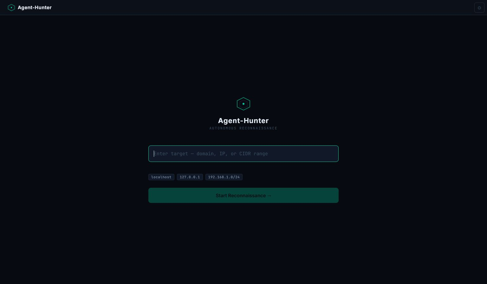
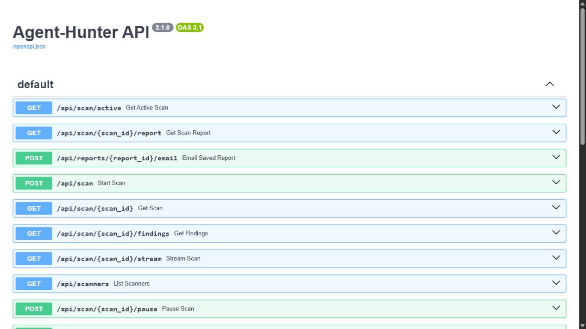
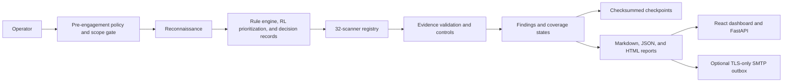

# Agent-Hunter

Agent-Hunter is an evidence-calibrated security assessment agent for authorized web application and API testing. It combines scoped reconnaissance, a 32-scanner registry, policy-aware orchestration, bounded active checks, explicit evidence states, recoverable execution, reporting, and a React/FastAPI operations interface.

> [!IMPORTANT]
> Use Agent-Hunter only on systems you own or have explicit written authorization to test. A public bug-bounty program authorizes only the assets, techniques, traffic levels, and time windows stated in its current rules. Never treat a company name, wildcard guess, or third-party dependency as permission.

## Screenshots

### Reconnaissance dashboard



### FastAPI/OpenAPI interface



## What Agent-Hunter does

- Runs a staged workflow: pre-engagement checks, reconnaissance, strategy, scanning, validation, reflection, and reporting.
- Enforces target scope and policy decisions before and during active requests.
- Registers 32 scanners covering web, API, authentication, authorization, session, transport, configuration, and reconnaissance risks.
- Separates observations, suspicions, confirmed findings, refuted hypotheses, unresolved cases, and untested coverage.
- Maintains independent coverage states so “no finding” is not confused with “fully tested.”
- Uses checksummed checkpoints and last-known-good recovery for interrupted scans.
- Exposes a local FastAPI service with Server-Sent Events and a React operations dashboard.
- Generates Markdown, JSON, and HTML reports with redacted evidence.
- Supports optional outbound-only SMTP report delivery through a durable outbox.
- Uses reinforcement-learning signals to help prioritize modules. RL choices are strategy hints, not vulnerability proof.

## Architecture



The decision engine decides what is reasonable to attempt within policy. Individual scanners produce evidence, validators apply controls, and the reporter preserves the evidence and coverage status. Ambiguous results and cleanup failures escalate rather than being silently promoted to confirmed vulnerabilities.

See [Architecture.md](Architecture.md) for the detailed component map.

## Scanner coverage

The scanner registry includes these major groups:

- **Injection:** SQL injection, server-side template injection, command injection, CRLF injection, XXE, and XSS.
- **Authorization:** IDOR, broken access control, two-identity BOLA checks, and gated mass-assignment checks.
- **Authentication and sessions:** authentication behavior, JWT checks, cookie metadata, CSRF, and rate-limit behavior.
- **Modern APIs and protocols:** OpenAPI 3 discovery, GraphQL, OAuth/OIDC metadata and flow controls, WebSocket authorization, and authenticated-cache behavior.
- **Server-side request and routing:** SSRF, host-header handling, open redirects, and bounded redirect validation.
- **Files and paths:** path traversal and LFI/RFI checks.
- **Configuration and transport:** security headers, CORS, sensitive-data exposure, TLS/SSL, takeover indicators, and general configuration checks.
- **Concurrency:** bounded race-condition checks.

High-impact checks are deliberately constrained:

- BOLA confirmation requires two explicitly configured synthetic identities and stable semantic object identifiers.
- Mass assignment is disabled by default and requires explicit permission, an approved field, operator confirmation, an idempotency key, verification, and cleanup.
- Authenticated-cache checks require controlled identities and prime/probe controls.
- WebSocket testing has connection/message limits, closes its connections, blocks redirects, and enforces scope.
- OpenAPI discovery blocks external references and out-of-scope servers.
- OAuth active-flow checks require an approved synthetic client and in-scope endpoints.

## Evidence and coverage model

Finding evidence states:

- `observed`: a security-relevant property was seen, without proof of exploitability.
- `suspected`: evidence indicates a possible vulnerability but confirmation controls are incomplete.
- `confirmed`: the scanner’s declared validator and controls support the conclusion.
- `refuted`: a control or follow-up disproved the hypothesis.
- `unresolved`: execution ended without enough evidence for a conclusion.
- `not_tested`: the check was not performed.

Coverage states:

- `tested`
- `not_applicable`
- `blocked`
- `deferred`
- `failed`
- `not_tested`

Response changes, status differences, reflection, or body-length differences are not automatically treated as proof.

## Requirements

### Required software

| Requirement | Required for | Verified version or status |
|---|---|---|
| Git | Cloning and updating the project | Any current Git client; no exact minimum was measured |
| Python | CLI, scanners, API, reports, and launcher | Python 3.12 |
| Python `venv` and `pip` | Isolated dependency installation | Included with the verified Python installation |
| Node.js and npm | React dashboard | Node.js 22 and npm 10 |
| A modern browser | Dashboard and interactive API documentation | Required; no browser/version matrix has been certified |
| Network and DNS access | Installing dependencies and reaching an authorized remote target | Required only for the relevant operation |

The acceptance run used Windows PowerShell. Other current Windows shells, Linux, macOS, WSL, and other Python or Node.js versions may work, but they have not been verified by this project. Do not interpret a successful installation on one platform as proof that every scanner behaves identically on another.

`requirements.txt` installs the scanner runtime, FastAPI service, terminal interface, WebSocket support, and optional voice packages. Some systems need native audio or compiler packages before `PyAudio` can be installed. Voice operation is optional, but it is currently included in the main requirements file.

### Hardware and capacity

No formal minimum-hardware benchmark has been completed. As a practical starting point—not a guaranteed minimum—use a machine with at least four logical CPU cores, 8 GB RAM, and 2 GB free disk space for the source, Python environment, dashboard dependencies, reports, and checkpoints. Large scans, verbose logs, many discovered URLs, or concurrent services can require substantially more memory, disk, time, and network capacity.

Start with low request volume and monitor the target and Hunter host. Stop the scan if either system shows abnormal latency, memory pressure, disk exhaustion, error rates, or service instability.

### Required authorization and engagement information

Before scanning anything except an isolated system you own, the operator must have all of the following:

- Written authorization or a currently published vulnerability-disclosure/bug-bounty policy that explicitly covers the exact asset.
- Exact in-scope hosts, URLs, ports, paths, account types, and APIs.
- Explicit exclusions, prohibited vulnerability classes, traffic limits, testing windows, and data-handling rules.
- Confirmation that automated scanning and the intended authenticated or active techniques are allowed.
- A stop condition and an emergency contact for production-impact or unintended-data-access events.
- Dedicated test accounts and reversible test data when an authenticated or state-changing check is permitted.
- A safe evidence-retention and disclosure plan.

Authorization is not inherited by sibling domains, parent companies, cloud/CDN providers, customer tenants, third-party integrations, or assets discovered during reconnaissance.

### Optional capability requirements

| Capability | Additional requirement |
|---|---|
| AI-assisted strategy | A locally reachable Ollama installation and model; use `--no-ai` when unavailable or when deterministic rules are preferred |
| Persistent learning/memory | Writable local report/state storage; use `--no-memory` for an isolated run |
| Authenticated scanning | A dedicated permitted test account or short-lived test token; never use another person's account or production secrets |
| Proxy inspection | An operator-controlled HTTP proxy configured with `--proxy`; proxying may expose sensitive traffic to that proxy |
| Voice modes | Working microphone/speaker, OS audio support, and any engine-specific dependencies or network access |
| Telegram bridge | A dedicated `TELEGRAM_BOT_TOKEN`; the bridge must not be used to transmit secrets or unredacted evidence |
| Outbound report email | STARTTLS-capable SMTP credentials, verified sender, recipient allowlist, and a local API token where the API endpoint is used |

Supabase, Bugcrowd, HackerOne, SMTP, Telegram, Ollama, and any other external account are not required for ordinary local scanning. Agent-Hunter does not need or receive permission to manage those services merely because credentials are configured.

## Who can use Agent-Hunter

Agent-Hunter is intended for people who can understand the authorization boundary and manually review scanner evidence:

- Owners testing applications and APIs they control.
- Internal application-security, product-security, and engineering teams working under an approved test plan.
- Contracted penetration testers whose written statement of work covers the exact techniques and assets.
- Bug-bounty or vulnerability-disclosure researchers following the program's current scope and automation rules.
- Educators and students using isolated labs, intentionally vulnerable targets, CTF environments, or systems for which the institution has granted explicit permission.

It is not an unattended “find and exploit everything” tool. A qualified human operator remains responsible for scope, traffic, credentials, interpretation, cleanup, and disclosure. Beginners should use localhost or a disposable lab first and should not start with a live production or bug-bounty target.

## Where it may and may not be used

Appropriate environments include:

- Localhost, private labs, disposable containers/VMs, and intentionally vulnerable training applications.
- Development or staging systems where the owner has approved the scan and can restore state.
- Production systems only when written authorization explicitly permits the selected automated techniques, traffic level, time window, and test accounts.
- Bug-bounty assets only after a same-day review of the official program page confirms the exact asset and behavior are in scope.

Do not use Agent-Hunter for:

- Any system without explicit permission, including “harmless” reconnaissance when the owner or program forbids automation.
- Out-of-scope hosts, paths, mobile apps, APIs, IP ranges, tenants, or vulnerability types.
- Third-party infrastructure merely linked from, embedded in, or discovered through an authorized asset.
- Denial of service, destructive payloads, uncontrolled data modification, bulk extraction, credential stuffing, password spraying, phishing, social engineering, malware delivery, persistence, evasion, or physical attacks.
- Accessing another user's data beyond the minimum proof explicitly permitted by the program. Stop immediately on unintended personal, financial, health, authentication, or customer data.
- Reading email, retrieving OTPs, bypassing MFA/CAPTCHAs, signing in to Bugcrowd or HackerOne, or submitting reports automatically.
- Continuous unattended production scanning without a human monitor and an agreed incident/rollback process.

The scanner's scope checks reduce risk but cannot create legal authorization, correctly interpret every program rule, or guarantee that a target will tolerate the traffic.

## Quick start

The project is published through two synchronized GitHub repositories. Clone either location:

```powershell
git clone https://github.com/Anantha-236/Agent-Hunter.git
Set-Location Agent-Hunter
```

or:

```powershell
git clone https://github.com/Hunter-The-Pentester/Hunter-The-Pentester.git
Set-Location Hunter-The-Pentester
```

Create an isolated Python environment:

```powershell
python -m venv .venv
.\.venv\Scripts\Activate.ps1
```

Start the backend and dashboard:

```powershell
python startservers.py --api-host 127.0.0.1 --ui-host 127.0.0.1
```

The launcher installs `requirements.txt` and the dashboard packages on its first run. Binding to `127.0.0.1` keeps the development interfaces on the local machine. The launcher's default host is `0.0.0.0`; do not use that default on an untrusted network or expose this development service to the internet.

When dependencies are already installed:

```powershell
python startservers.py --api-host 127.0.0.1 --ui-host 127.0.0.1 --skip-python-install --skip-dashboard-install
```

Open:

- Dashboard: <http://localhost:5173>
- API documentation: <http://localhost:8888/docs>

Press `Ctrl+C` in the launcher terminal to stop services started by the launcher.

In VS Code or Antigravity, open the cloned repository folder and run the same commands in the integrated PowerShell terminal. Opening only `dashboard/` omits the Python backend and is not a complete project startup.

### Manual startup

Backend:

```powershell
python -m pip install -r requirements.txt
python -m uvicorn api_server:app --host 127.0.0.1 --port 8888 --reload
```

Dashboard, in another terminal:

```powershell
Set-Location dashboard
npm.cmd install
npm.cmd run dev
```

## How to use Agent-Hunter

### 1. Verify the installation without scanning

Run these checks from the repository root:

```powershell
python --version
node --version
npm.cmd --version
python main.py --help
```

Start the local services and open the dashboard and API documentation:

```powershell
python startservers.py --api-host 127.0.0.1 --ui-host 127.0.0.1
```

Service startup proves only that the local interface is reachable. It does not validate a target, authorize a scan, or prove every scanner is accurate.

### 2. Perform the first scan against localhost

Start an application you own on `127.0.0.1:8000`, then run:

```powershell
python main.py `
  --target http://127.0.0.1:8000 `
  --scope 127.0.0.1 `
  --yes `
  --no-tui `
  --no-ai `
  --no-memory
```

This example intentionally targets localhost and disables AI and persistent learning. `--yes` skips the interactive safety confirmation and is appropriate here only because the example is an operator-controlled local target. Do not copy it blindly into an external scan.

Review the terminal output and generated files under `reports/`. Verify that the reported target, scope, modules, coverage states, and evidence match the local test application.

### 3. Prepare an authorized non-local assessment

1. Save a dated copy of the written authorization or official program rules.
2. Back up systems and data you own when a state-changing test is possible. A public bug-bounty target is not yours to back up; use only techniques the program permits.
3. Copy either `data/example_bbp_policy.json` or `data/example_pre_engagement.json` to a new target-specific file outside version control.
4. Replace every Acme value. Record exact scope, exclusions, automation permission, allowed vulnerability types, request rate, testing hours, data rules, stop conditions, and emergency contact.
5. Compare the policy file with the current official rules immediately before every live session. Stop if the rules are unavailable, ambiguous, or have changed.
6. Create dedicated test accounts and synthetic reversible records where permitted. Do not use another user's credentials or real customer data.
7. Start with the smallest in-scope host and the least invasive applicable modules. Do not assume a discovered host, redirect, schema server, OAuth issuer, CDN, or WebSocket endpoint is in scope.
8. Keep a human operator present to watch traffic, latency, HTTP `429`/`5xx` responses, authentication failures, unexpected data, and target health.

The included Acme policies are fictional schema examples. They are not authorization and must never be used unchanged against a real target.

### 4. Run a bounded command

Use an explicit target, scope, exclusions, policy, and module list. The following values are placeholders and must be replaced only with authorized values:

```powershell
python main.py `
  --target https://app.authorized-example.test `
  --scope app.authorized-example.test `
  --exclude status.authorized-example.test `
  --policy C:\secure\authorized-example-policy.json `
  --modules xss_scanner `
  --no-ai `
  --no-memory
```

Leave off `--yes` for the first run so the pre-scan review remains visible. Add one module or capability at a time only after the previous result and target health have been reviewed. The policy's request-rate value is an upper bound, not a safe default; use the lowest practical traffic level and obey a stricter limit wherever one exists.

Optional CLI controls include:

| Option | Purpose and caution |
|---|---|
| `--modules ...` | Restrict the scanner set; preferred for the first run |
| `--exclude ...` | Add explicit domain exclusions; exclusions do not replace an accurate allowlist |
| `--proxy URL` | Route HTTP traffic through an operator-controlled proxy; the proxy can see traffic and credentials |
| `--no-ai` | Disable Ollama-assisted strategy and validation |
| `--no-memory` | Prevent persistent learning/memory for an isolated session |
| `--insecure` | Disable TLS certificate verification; use only for an authorized lab because it weakens transport validation |
| `--output-dir PATH` | Place runtime evidence in a controlled directory with sufficient disk space |
| `--resume` | Resume the legacy active checkpoint only when the target and policy still match |
| `--email-report` | Explicitly send the generated redacted JSON report using configured SMTP settings |

`--cookie`, `--header`, `--login-pass`, and `--bearer-token` can expose secrets through command history, process inspection, logs, or screenshots. Use only dedicated, short-lived test credentials on a controlled workstation. Never paste production passwords, session cookies, OTPs, or third-party user tokens into Hunter.

### 5. Monitor, interpret, and stop safely

During a scan:

- Stop on unexpected data access, target instability, repeated `429`/`5xx` responses, an out-of-scope redirect, policy uncertainty, or evidence that a check could modify real data.
- Use the dashboard/API pause or abort controls for scans started through the API. For a foreground CLI scan, press `Ctrl+C` and preserve its checkpoint/report files for review.
- Treat `blocked`, `deferred`, `failed`, and `not_tested` coverage as incomplete testing—not as a clean result.
- Treat `observed`, `suspected`, and `unresolved` results as leads requiring safe manual validation. Even `confirmed` means the scanner's declared controls passed; a human must still verify scope, reproducibility, impact, and false-positive conditions.
- Never increase traffic or invasiveness solely because the RL policy ranks a module highly. The RL output is a prioritization hint and does not override deterministic policy, scope, or human judgment.

### 6. Validate, report, and clean up

1. Reproduce a potential issue with the fewest requests and least data necessary.
2. Run a negative control and document alternative explanations such as caching, reflection, generic errors, session differences, or unstable upstream behavior.
3. Remove credentials, authorization headers, cookies, personal data, full response bodies, internal identifiers, and unrelated records from evidence.
4. Describe what was tested, what was not tested, the exact evidence state, affected asset, prerequisites, bounded reproduction steps, impact, and remediation.
5. Submit through the owner's authorized disclosure channel. Agent-Hunter does not submit reports to Bugcrowd, HackerOne, or another platform for you.
6. Delete synthetic records if permitted, close test sessions, revoke temporary tokens, and notify the emergency contact if cleanup is incomplete.
7. Retain or destroy reports, checkpoints, proxy captures, logs, and test credentials according to the engagement's data-retention rules.

## Decision and accuracy boundaries

Agent-Hunter can enforce machine-readable rules and collect evidence, but it cannot reliably infer every legal, operational, or business consequence. The operator must make the final decision whenever:

- Authorization, scope language, or asset ownership is ambiguous.
- A technique may affect availability, integrity, billing, other users, or production data.
- Authentication, authorization, caching, asynchronous processing, or multi-tenant behavior cannot be reproduced with safe controls.
- The target returns unstable responses or a protective control changes the observed behavior.
- Cleanup, rollback, or data deletion cannot be proven.
- Scanner output conflicts with the official program rules or a human observation.

No automated scanner can guarantee complete coverage, zero false positives, zero false negatives, or future-safe behavior after either Hunter or the target changes. A “no findings” report is not a security certification.

## API

The local API includes:

| Method | Route | Purpose |
|---|---|---|
| `POST` | `/api/recon` | Start reconnaissance |
| `GET` | `/api/recon/{recon_id}` | Read reconnaissance state |
| `GET` | `/api/recon/{recon_id}/stream` | Stream reconnaissance events |
| `POST` | `/api/scan` | Start a scan |
| `GET` | `/api/scan/active` | Read the active scan |
| `GET` | `/api/scan/{scan_id}` | Read scan state |
| `GET` | `/api/scan/{scan_id}/findings` | Read findings |
| `GET` | `/api/scan/{scan_id}/report` | Read the generated report |
| `GET` | `/api/scan/{scan_id}/stream` | Stream scan events |
| `POST` | `/api/scan/{scan_id}/pause` | Pause a running scan |
| `POST` | `/api/scan/{scan_id}/abort` | Abort a running scan |
| `GET` | `/api/scanners` | List scanner capabilities |
| `GET` | `/api/settings` | Read local settings |
| `PUT` | `/api/settings` | Update local settings |
| `POST` | `/api/reports/{report_id}/email` | Explicitly queue/deliver a known report |

Interactive API schemas and request examples are available at `/docs` while the backend is running.

## Checkpoints and recovery

The v2 orchestrator writes per-scan checkpoints under:

```text
reports/checkpoints/<scan-id>/checkpoint.json
```

These checkpoints are versioned and checksummed. The orchestrator's programmatic resume path requires the exact target and matching policy snapshot. If the active checkpoint is corrupt, that path can restore a valid last-known-good generation. An unfinished non-idempotent action is not replayed automatically; it is escalated for human review.

The current CLI `--resume` option still looks for the older root-level `scan_checkpoint.json`; it is not a selector for an arbitrary v2 per-scan checkpoint. Do not rename, rewrite, or manually replay a checkpoint to bypass target or policy validation. Preserve the full checkpoint directory and use a fresh scan when no reviewed compatible recovery path is available.

Runtime reports, databases, caches, secrets, and checkpoints are ignored by Git.

## Outbound report email

Email is outbound-only and opt-in. Normal scans and report generation do not contact an SMTP server. Agent-Hunter does not read inboxes, retrieve OTPs, solve MFA/CAPTCHAs, sign in to Bugcrowd or HackerOne, or submit reports automatically.

Copy the empty keys from `.env.local.example` into an ignored `.env.local`:

```text
SMTP_HOST=smtp.provider.example
SMTP_PORT=587
SMTP_USERNAME=your-smtp-username
SMTP_PASSWORD=your-new-app-password
SMTP_STARTTLS=true
SMTP_REPORT_FROM=your-verified-sender@example.com
SMTP_REPORT_TO=your-allowed-recipient@example.com
SMTP_RECIPIENT_ALLOWLIST=your-allowed-recipient@example.com
SMTP_MAX_ATTACHMENT_BYTES=5242880
HUNTER_LOCAL_API_TOKEN=a-long-random-local-token
```

`SMTP_STARTTLS` must be true. Recipient addresses must be allowlisted. Oversized, non-UTF-8, or insufficiently redacted reports are rejected before entering the outbox.

Send the redacted JSON report after an authorized CLI scan:

```powershell
python main.py --target http://127.0.0.1:8000 --scope 127.0.0.1 --yes --email-report
```

Retry due outbound messages:

```powershell
python main.py --retry-email-outbox
```

Delivered messages and messages marked `delivery_unknown` are not automatically resent.

Never commit a real SMTP password, token, cookie, authorization header, OTP, request body, or user-submitted form value. If a credential has appeared in chat, logs, terminal history, or a committed file, revoke it and create a new one.

## Troubleshooting and recovery

Start with the exact error message, the command used, `python --version`, `node --version`, free disk space, and whether ports `8888` and `5173` are already in use. Never work around an error by expanding scope, disabling safeguards, raising traffic, or substituting real credentials.

| Problem | Likely meaning | Safe resolution |
|---|---|---|
| `python`, `node`, `npm`, or `git` is not recognized | The tool is missing or not in `PATH` | Install a current runtime, restart the terminal, and re-run the version commands. On Windows use `npm.cmd` if PowerShell blocks `npm.ps1`. |
| PowerShell refuses `.\.venv\Scripts\Activate.ps1` | Script execution policy blocks activation | Run `Set-ExecutionPolicy -Scope Process -ExecutionPolicy Bypass`, or skip activation and invoke `.\.venv\Scripts\python.exe` directly. Do not weaken the machine-wide policy. |
| `pip install` fails on `PyAudio` | A compatible wheel or native PortAudio/compiler dependency is unavailable | Use the verified Python version, install the OS audio/build prerequisite, or run in a supported environment. Voice is optional, but removing the pinned package changes the documented dependency set and must be tested. |
| `npm install` fails | Registry/network failure, unsupported Node version, file locking, or a damaged local dependency tree | Confirm Node/npm versions and registry access, close processes using `dashboard/node_modules`, and retry from `dashboard/`. Do not delete the committed lockfile or apply breaking upgrades casually. |
| `npm audit` reports vulnerabilities | A dependency advisory applies somewhere in the dependency graph | Review each advisory and reachable impact. Test deliberate upgrades in a branch. Do not use `npm audit fix --force` without reviewing breaking changes. The current lockfile's known count is listed under **Known limitations**. |
| Port `8888` or `5173` is already in use | Another API/dashboard process is running | Open the existing URL to confirm it is Hunter or stop the exact owning process. A different UI port can use `--ui-port`. For a different API port, set `$env:VITE_API_BASE='http://127.0.0.1:<port>/api'` before starting with `--api-port <port>`; keep the UI on an allowed origin. Do not kill an unidentified process. |
| API starts but the dashboard cannot connect | Wrong API base/port, stale frontend process, firewall, or browser cache | Confirm `/api/settings` and `/docs` load directly. The development proxy defaults to API port `8888`; set `VITE_API_BASE` when changing that port, restart both services, and inspect the browser network error. |
| Dashboard or API is reachable from other machines unexpectedly | The launcher defaults to `0.0.0.0` bind addresses | Stop it and restart with `--api-host 127.0.0.1 --ui-host 127.0.0.1`. This is a development interface, not an internet-facing deployment. The report-email API action requires `HUNTER_LOCAL_API_TOKEN`, but that does not make every API route an authenticated production service. |
| Target does not resolve or connect | DNS, proxy, VPN, firewall, TLS, or target availability problem | Verify the exact in-scope hostname through the required network path. Do not substitute a discovered IP or alternate hostname unless it is independently in scope. |
| TLS verification fails | Expired, untrusted, mismatched, or intercepted certificate | Record the failure as evidence and fix the lab certificate where possible. Use `--insecure` only in an authorized lab; never normalize disabling verification for live targets. |
| Target returns `401` or `403` | Authentication is absent/expired, the account lacks permission, or a protective control denied the request | Stop repeated attempts. Validate a dedicated test account manually, confirm authenticated testing is permitted, then refresh only that test credential. Do not attempt bypasses merely to make the scanner continue. |
| Target returns `429`, timeouts, or rising `5xx` responses | Rate limiting, overload, WAF behavior, upstream instability, or network loss | Pause/abort immediately, lower traffic, preserve timestamps, and wait only as permitted. Contact the program/owner if target health may be affected. Do not rotate IPs or headers to evade limits unless explicitly authorized. |
| A scanner is `blocked` or `deferred` | Policy permission, applicability evidence, synthetic accounts, or safe prerequisites are missing | Read its coverage reason. Supply only authorized prerequisites or accept the coverage gap. Do not convert the status into `tested` or widen permissions simply to increase coverage. |
| A scanner is `failed` or `not_tested` | Execution error or the check never ran | Inspect logs and coverage records, reproduce on a local fixture, and rerun only the affected module after fixing the cause. The status is not proof that the target is safe or vulnerable. |
| Many findings look identical or unstable | Generic errors, reflection, caching, load balancing, WAF responses, or weak differential controls may be producing false positives | Compare baselines, repeat at low volume, add negative controls, and verify target-side state where authorized. Downgrade to `suspected`/`unresolved` when decisive proof is absent. |
| Hunter reports no findings | Tests may be inapplicable, blocked, unconfigured, or affected by false negatives | Review the coverage matrix and errors, not only the finding count. Manually verify important attack surfaces and use a second independent method where the engagement permits it. |
| Authenticated results are inconsistent | Session expiry, CSRF rotation, different roles/tenants, caching, or stateful workflows are changing responses | Use dedicated accounts with clearly documented roles, capture only redacted metadata, re-establish the baseline, and stop if user/tenant boundaries cannot be tested without real data. |
| A checkpoint cannot resume | It is corrupt, legacy, from another target/policy, or inaccessible | Preserve the checkpoint directory, verify file permissions and disk health, and do not alter identity/hash fields. Current CLI limitations are described under **Checkpoints and recovery**; start a fresh reviewed scan when compatible recovery is unavailable. |
| Disk fills or reports are missing | Reports, logs, dependencies, or checkpoints consumed available space; writes may have failed | Stop the scan, preserve existing evidence, free space outside the active report directory, verify write permissions, and rerun only after confirming the target remains safe to test. |
| CPU or memory usage becomes excessive | Too many modules/URLs, dependency services, browser processes, or verbose logging are active | Stop or pause, reduce modules and target surface, close unneeded services, and monitor resource use before restarting. Never trade target stability for coverage. |
| SMTP configuration is rejected | Missing variable, invalid port/address, STARTTLS disabled, sender mismatch, recipient not allowlisted, or report rejected by redaction/size checks | Correct `.env.local`, keep `SMTP_STARTTLS=true`, verify sender and allowlist, and test with a fake/local SMTP server before a real provider. Never disable recipient or redaction controls. |
| Email delivery is `delivery_unknown` | The connection failed after the server may have accepted the message | Check the provider's sent/audit log and recipient once. Do not automatically resend; that can duplicate a sensitive report. |
| RL chooses an unsuitable module | Learned ranking reflects limited historical signals, not current authorization or proof | Reject the recommendation, use `--modules` and `--no-ai`/`--no-memory`, and rely on deterministic policy and human review. Do not reward unvalidated findings. |
| `Ctrl+C` does not immediately remove child processes | A dependency process outlived the launcher or was started separately | Identify the exact process owning Hunter's configured ports and stop only that process. Confirm the ports are free before restarting. |

When a scan may have caused harm: stop all Hunter traffic, preserve logs/checkpoints without editing them, record the time and last action, notify the authorized emergency contact, revoke test credentials, verify cleanup with the owner, and do not resume until the owner approves a recovery plan.

## Testing

Install the development dependencies:

```powershell
python -m pip install -r requirements-dev.txt
```

Run the complete Python suite:

```powershell
python -m pytest -q
```

Build the dashboard:

```powershell
Set-Location dashboard
npm.cmd ci
npm.cmd run build
```

The RL-specific commands are documented in [CI_README.md](CI_README.md).

## Verified status

Local verification on 2026-09-24 established:

| Area | Result |
|---|---|
| Python suite | 330 tests passed |
| Scanner registry | 32 scanners initialized |
| Dashboard production build | Passed |
| Local API startup | HTTP 200 verified |
| Local dashboard startup | HTTP 200 verified |
| SMTP | Fake local SMTP integration verified |
| Live bug-bounty target | Not tested |
| Real SMTP provider | Not tested |
| Real OAuth provider, CDN, or WebSocket service | Not tested |

Detailed acceptance evidence:

- [Foundation acceptance](docs/verification/foundation-acceptance.md)
- [Modern scanner acceptance](docs/verification/modern-scanners-acceptance.md)
- [SMTP acceptance](docs/verification/smtp-acceptance.md)

## Known limitations

- Controlled fixtures demonstrate bounded behavior; they do not establish universal real-world accuracy or coverage of every vulnerability.
- Dashboard lint currently reports 15 errors and 1 warning in pre-existing React code, although the production build succeeds.
- The current dashboard dependency lock reports 14 npm advisories: 2 low, 2 moderate, and 10 high. These require dependency review; no automatic breaking upgrade was applied.
- Existing Python code emits `datetime.utcnow()` deprecation warnings.
- The broad legacy misconfiguration scanner still needs additional real-world precision calibration.
- The current CLI `--resume` path does not select the v2 per-scan checkpoint tree; see **Checkpoints and recovery**.
- No minimum hardware threshold, cross-platform compatibility matrix, or browser compatibility matrix has been benchmarked.
- An RL-selected action is not evidence that a vulnerability exists.
- Operator review remains required for scope, active testing, suspected findings, cleanup failures, and report submission.

## Responsible reporting

Before reporting a finding:

1. Confirm that the exact asset and technique are in scope.
2. Minimize data access and stop after sufficient proof.
3. Remove secrets, personal data, cookies, tokens, and unrelated response bodies from evidence.
4. Document controls and failed hypotheses, not only successful requests.
5. Explain impact without exaggeration.
6. Provide reproducible, bounded steps.
7. Follow the program’s disclosure channel and retention rules.

## Contributing

1. Open an issue describing the proposed change.
2. Create a focused branch.
3. Add or update tests.
4. Preserve the scope, evidence, redaction, and recovery boundaries.
5. Submit a pull request for owner review.

Do not add external source dumps, generated reports, runtime databases, local environment files, dependency directories, or credentials to the repository.

## License

Proprietary — All Rights Reserved.

No part of this repository may be copied, modified, distributed, sublicensed, or used for commercial or personal derivative work without explicit written permission from the repository owner.

## Author

Anantha
GitHub: [Anantha-236](https://github.com/Anantha-236)
