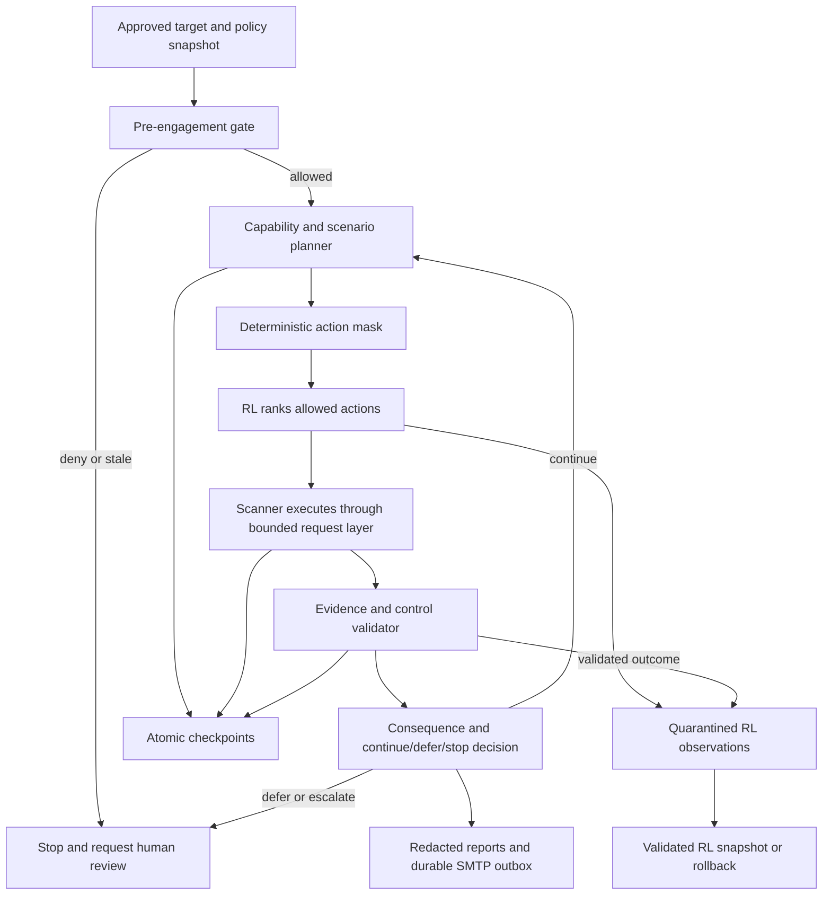

# Agent-Hunter Modernization and Resilience Design

**Date:** 2026-09-23

**Status:** Proposed for user review

**Scope:** Agent-Hunter only. This design does not authorize changes to Supabase, Bugcrowd, HackerOne, or any third-party target.

## 1. Objective

Modernize Agent-Hunter so its scanners produce better-supported findings, its decision system plans ahead without crossing safety boundaries, and its local state can recover cleanly from crashes, corruption, network failures, or a faulty learning update.

The system must answer four questions before every meaningful action:

1. Is the action explicitly in scope and allowed by the current program policy?
2. What evidence should the action produce, and how will that evidence be verified?
3. What could go wrong, how reversible is it, and what is the safe fallback?
4. Is continuing more valuable than stopping, deferring, or asking for human review?

Agent-Hunter cannot promise to test every possible vulnerability or recover from every external consequence. It can provide a traceable coverage matrix, accurately label what was and was not tested, and autonomously recover only within bounded local operations. A deterministic safety layer always has veto power over AI and RL suggestions.

## 2. Confirmed Existing Foundation

The implementation will extend the current architecture rather than introduce a parallel application:

- `core/orchestrator.py` already owns scan phases, per-module execution, timeouts, and checkpoints.
- `core/bbp_policy.py` and `core/pre_engagement.py` already represent program rules and pre-engagement checks.
- `core/responsibility_engine.py` and `core/consequence_analyzer.py` already record finding-level decisions and impact.
- `core/rl_agent.py` already ranks scanner modules and persists policy state.
- `core/models.py` already carries findings, confidence, confirmation, evidence, and scan state.
- `reporting/reporter.py` already creates local Markdown, JSON, and HTML reports.

The modernization addresses observed limitations in those paths:

- module-policy checks currently warn about some risky behavior but do not reliably deny execution;
- checkpoint and RL-state files are written directly and can be left partially written after interruption;
- module rewards can be learned before findings receive sufficiently independent validation;
- finding states are represented by overlapping booleans instead of one explicit evidence status;
- scanner capabilities and side effects are not declared in a machine-readable registry;
- report delivery has no durable, secret-safe outbound email path;
- current scanner coverage lacks several modern API and browser protocol checks.

## 3. Non-Negotiable Boundaries

### 3.1 Authorization and scope

- Only assets listed in a locally approved, current program-policy snapshot may receive active traffic.
- A redirect, discovered hostname, alternate port, API host, CDN host, or WebSocket endpoint is a new asset unless the policy explicitly covers it.
- The policy snapshot is timestamped and hashed. If it changes or expires, the scan stops until a human reviews and acknowledges the new snapshot.
- Later testing on Bugcrowd or HackerOne is per-program and per-asset. The existence of a platform account is not blanket authorization to scan all programs.
- Platform login, MFA, CAPTCHA, OTP retrieval, and final report submission remain manual.

### 3.2 Credentials and sensitive data

- The email address is configuration, not source code. Use an environment variable such as `SMTP_REPORT_TO`.
- The previously shared app password must never be copied into source, examples, reports, logs, tests, fixtures, commits, or state files. It should be revoked and replaced before SMTP is configured.
- SMTP support is outbound report delivery only. Agent-Hunter will not read an inbox, retrieve OTPs, automate MFA, or use IMAP for authentication workflows.
- Raw passwords, OTPs, payment values, cookies, bearer tokens, authorization headers, request bodies, and clipboard contents must not be persisted or emitted into reports.
- Secrets are provided at runtime through environment variables or an operating-system secret provider and are redacted before logging.

### 3.3 Safety hierarchy

The decision order is fixed:

1. authorization and scope gate;
2. program-policy and payload-safety gate;
3. rate, side-effect, and data-handling gate;
4. evidence and consequence gate;
5. deterministic fallback strategy;
6. RL ranking among the actions that remain allowed.

RL may choose order and timing. It may never override a denial, expand scope, increase privilege, disable redaction, weaken rate limits, or convert an unverified result into a confirmed vulnerability.

## 4. Proposed Architecture



### 4.1 Scanner capability registry

Add `core/scanner_capabilities.py` as the authoritative metadata registry. Every scanner must declare:

- stable module name and version;
- vulnerability families and applicable technologies;
- traffic class: `PASSIVE`, `SAFE_ACTIVE`, `STATE_CHANGING`, or `DISRUPTIVE`;
- authentication prerequisites and required actor count;
- request-cost estimate and maximum concurrency;
- possible side effects and whether cleanup is possible;
- required policy permissions;
- expected positive and negative controls;
- minimum evidence required for each confidence state;
- supported fallback scanner or manual workflow;
- idempotency expectations and safe resume boundary.

Registration fails closed when required metadata is missing. `STATE_CHANGING` and `DISRUPTIVE` capabilities are disabled by default. A program policy may narrow permissions but cannot silently broaden the software default.

### 4.2 Scenario and decision engine

Add `core/decision_engine.py`. It receives the approved policy, current scan state, capability metadata, evidence completeness, failure history, remaining risk/request budget, and consequence assessment.

It produces a durable decision record:

```text
decision_id
timestamp
candidate_actions
allowed_actions
denied_actions_with_rules
chosen_action
expected_evidence
risk_and_side_effects
reversibility_and_recovery_plan
uncertainty
policy_snapshot_hash
outcome: CONTINUE | DEFER | STOP | ESCALATE
reason
```

The engine explicitly evaluates “go further” versus “leave it here”:

- `CONTINUE` only when the next action is authorized, bounded, reversible or harmless, and likely to add material evidence.
- `DEFER` when a useful action requires state, a second account, credentials, timing, or consent that is unavailable.
- `STOP` when further testing adds little evidence, exceeds the risk/request budget, repeats failures, reaches a critical proof threshold, or encounters policy drift.
- `ESCALATE` when human judgment, renewed authorization, target-owner coordination, or manual platform action is required.

Every action records its fallback before execution. A missing fallback is itself a reason to defer a state-changing action.

### 4.3 Evidence states and calibration

Replace ambiguous combinations of `confirmed` and `false_positive` with an explicit `EvidenceStatus` while retaining compatibility during migration:

- `NOT_TESTED`: planned coverage was not executed, with a reason;
- `OBSERVED`: raw behavior was captured but no security conclusion is established;
- `SUSPECTED`: behavior matches a vulnerability hypothesis but lacks a decisive control;
- `CONFIRMED`: a minimally invasive, repeatable differential proves the security property failed;
- `REFUTED`: a control or validation disproved the hypothesis;
- `UNRESOLVED`: evidence conflicts or cannot be safely completed.

A `Finding` gains structured evidence references, validator results, control results, timestamps, scanner version, target identity, policy hash, and a confidence explanation. Confirmation requirements are vulnerability-specific. HTTP status, response length, reflected strings, or a single error message are never sufficient by themselves unless that signal is the exact security property under test.

The evidence pipeline in `core/evidence.py` will:

1. record a redacted baseline;
2. execute a bounded test case;
3. execute a negative or alternate-principal control when safe and required;
4. compare semantic evidence rather than only length or status;
5. repeat safe observations when necessary;
6. assign an evidence state and confidence rationale;
7. prevent RL learning from `SUSPECTED`, `UNRESOLVED`, or structurally weak results.

Reports must include coverage and uncertainty: tested, not applicable, blocked by policy, deferred, failed, and not tested. This is the honest substitute for claiming “every possibility” was tested.

### 4.4 Modern scanner work

The modernization will first fix cross-cutting correctness, then add bounded scanners based on modern application patterns:

- content-type-aware security header analysis, avoiding browser-header findings on non-document JSON responses where the header has no applicable protection;
- OpenAPI discovery and schema-driven endpoint/parameter coverage with strict scope filtering;
- REST object-authorization/BOLA workflows using two explicitly provided test identities and non-destructive reads by default;
- mass-assignment detection using allowlisted, reversible test fields and no production-user privilege changes;
- OAuth 2.0 and OpenID Connect configuration checks for redirect validation, state/nonce handling, PKCE expectations, issuer/audience consistency, and public metadata exposure;
- cookie and session-configuration analysis without persisting cookie values;
- cache behavior checks for authentication variance and private response storage, using redacted response fingerprints;
- GraphQL schema and authorization improvements with depth, cost, and introspection policy controls;
- WebSocket origin/authentication/authorization checks with explicit endpoint scope and message budgets.

All new scanners begin in a local controlled target suite. Any scanner needing writes, concurrent races, external callbacks, or destructive payloads remains disabled unless a narrowly written policy and human confirmation permit that exact behavior.

## 5. RL Decision “Brain”

### 5.1 State and action model

Extend the RL environment with:

- policy-permitted action mask;
- target and endpoint sensitivity;
- capability traffic class and reversibility;
- remaining request, time, and risk budgets;
- evidence completeness and uncertainty;
- consecutive timeouts/errors/429 responses;
- scanner reliability and false-positive history;
- authentication availability without including secrets;
- detected defensive pressure such as rate limiting;
- recovery status and checkpoint health.

The utility signal is multi-objective:

```text
expected information gain
+ validated detection value
+ coverage value
- false-positive cost
- request and time cost
- side-effect risk
- policy uncertainty
- repeated-failure cost
```

Hard constraints are action masks, not reward penalties. An unsafe action must be impossible to select rather than merely unattractive.

### 5.2 Learning governance

- Online observations enter a quarantine buffer first.
- Only evidence that passes validation can update the candidate policy.
- A deterministic baseline remains available at all times.
- Candidate (“challenger”) policy updates run against a fixed local regression corpus before promotion to the active (“champion”) policy.
- Promotion requires no scope/safety regressions, no material precision regression, and a documented coverage or efficiency improvement.
- Each promotion creates a signed or checksummed snapshot and preserves the previous last-known-good state.
- Invalid numbers, unknown actions, schema mismatch, corrupted checksums, or regression-gate failure trigger rollback.
- Human-readable decision records are required even when RL supplied the ranking.

This is bounded self-recovery, not unrestricted self-modification. The system may retry safely, choose a declared fallback, quarantine a failing module, restore a checkpoint, or revert the RL model. It must pause for human action when authorization, identity, consent, destructive impact, or ambiguous external state is involved.

## 6. Backup, Recovery, and Consequence Plans

Backups cover Agent-Hunter’s local state and reports. They do not back up or restore a third-party website or application.

### 6.1 Atomic local persistence

Add `core/recovery.py` with a single atomic persistence primitive:

1. serialize to a uniquely named file in the destination directory;
2. flush and synchronize the file;
3. validate schema and checksum by reading it back;
4. rotate the current valid file to `.bak`;
5. atomically replace the destination;
6. retain a bounded number of versioned snapshots;
7. synchronize the directory where supported.

This primitive is used for checkpoints, policy snapshots, decision journals, RL state, evidence manifests, reports, and the SMTP outbox.

### 6.2 Checkpoints

Replace the single unvalidated `scan_checkpoint.json` workflow with per-scan, versioned checkpoints containing:

- schema version, checksum, scan ID, and generation number;
- approved target identity and policy snapshot hash;
- completed action IDs and the next safe action boundary;
- module cursor, findings/evidence references, decisions, budgets, and errors;
- scanner and application versions;
- last successful validation time.

Resume validates the checksum, schema, target, and policy hash. If the newest checkpoint is invalid, Agent-Hunter attempts the last-known-good generation. It never repeats a state-changing action unless the action declares an idempotency key and the prior outcome is known.

### 6.3 RL snapshots

Before any promotion or persisted learning update, save a validated snapshot. Retain:

- current champion;
- previous last-known-good champion;
- quarantined challenger;
- evaluation results and model/config hashes.

Load failure or performance regression falls back to the deterministic planner and marks RL as degraded instead of stopping all safe scanning.

### 6.4 Evidence integrity and privacy

An evidence manifest stores hashes, timestamps, normalized request metadata, response fingerprints, validation outcomes, and redaction status. Raw sensitive fields are excluded at capture time, not removed only during report rendering. Reports refer to evidence IDs and never require secrets to reproduce a safe proof.

### 6.5 Failure scenario matrix

| Scenario | Immediate decision | Automatic recovery | Human boundary |
|---|---|---|---|
| Redirect or discovery leaves approved scope | `STOP` that branch | Record denied target; continue unrelated in-scope work | Review policy before adding asset |
| Program policy changed or expired | `STOP` | Preserve checkpoint and diff snapshot | Re-acknowledge current rules |
| Authentication expires or returns 401/403 | `DEFER` auth-dependent work | Preserve state; continue public safe checks | Log in or provide fresh test session manually; no OTP retrieval |
| 429, WAF pressure, or explicit block | `DEFER` or `STOP` | Exponential backoff, circuit breaker, lower concurrency | No evasion unless exact policy explicitly permits it |
| Timeout or transient network error | `CONTINUE` only within retry budget | Jittered bounded retries; then fallback or quarantine | Review repeated target instability |
| Repeated scanner exceptions | `DEFER` module | Quarantine module and use declared safe fallback | Repair/re-enable after regression tests |
| Contradictory evidence | `DEFER` or `UNRESOLVED` | Run one safe control/repeat; lower confidence | Decide whether further proof is justified |
| State-changing outcome is ambiguous | `STOP` that workflow | Do not repeat automatically | Inspect target state and approve recovery |
| Checkpoint is corrupt | `DEFER` briefly | Restore last-known-good generation | Restart only if no valid generation exists |
| RL state is corrupt or regresses | `CONTINUE` safely | Roll back; use deterministic ranking | Review before promotion |
| SMTP delivery fails | Scan result remains complete | Durable outbox retry with backoff and idempotency key | Correct mail configuration or send manually |
| Process crashes during write | Resume from safe boundary | Atomic file replacement prevents partial active state | Review only if boundary cannot be established |
| Critical finding reaches sufficient proof | `STOP` endpoint or broader scan as policy requires | Freeze evidence and generate priority report | Human reviews and submits report |

## 7. Outbound SMTP Reporting

Add `integrations/email/` with a small, independent client used by the existing reporter. Configuration is environment-only:

```text
SMTP_HOST
SMTP_PORT
SMTP_USERNAME
SMTP_PASSWORD
SMTP_STARTTLS=true
SMTP_REPORT_FROM
SMTP_REPORT_TO
SMTP_RECIPIENT_ALLOWLIST
SMTP_MAX_ATTACHMENT_BYTES
```

Requirements:

- TLS verification is mandatory; insecure fallback is not allowed.
- Recipients must match the local allowlist. The initial destination may be the user’s account, but it is never hardcoded.
- Subject and body are sanitized, and attachments pass the central redaction check.
- Messages enter a durable local outbox before sending and have an idempotency key to prevent duplicates.
- Retries use bounded exponential backoff. A send failure never reruns the scan.
- The CLI/API offers explicit `--email-report` or equivalent consent; report generation alone does not send mail.
- Logs expose delivery state and message ID, never credentials or sensitive headers.
- Tests use a local fake SMTP server and synthetic secrets.
- No inbox reading, OTP retrieval, automated platform login, or automated report submission is included.

## 8. Bug-Bounty Operating Workflow

Later controlled testing follows this workflow for one program at a time:

1. Human selects a program and manually supplies or verifies its current rules.
2. Agent-Hunter creates a timestamped policy snapshot containing exact in-scope assets, exclusions, rate limits, allowed methods, prohibited findings/tests, authentication rules, and disclosure instructions.
3. A dry run shows planned traffic, scanner capabilities, estimated request volume, risk classes, and blocked modules.
4. Human acknowledges the snapshot and starts the scan.
5. Every request passes scope and policy gates; discoveries do not inherit scope automatically.
6. The decision engine maintains the coverage matrix and decides continue/defer/stop/escalate.
7. Evidence is validated with the least-impactful proof and redacted at capture.
8. Agent-Hunter generates a draft report and may email it to an allowlisted address.
9. Human reviews accuracy, program eligibility, duplicate risk, impact, and sensitive data.
10. Human logs in and submits through Bugcrowd or HackerOne manually.

No broad platform-wide scan, credential automation, CAPTCHA/MFA bypass, OTP collection, or unattended report submission is part of this design.

## 9. Integration Points and Expected Files

Existing files to extend:

- `core/orchestrator.py`: decision loop, action masks, checkpoints, quarantine, recovery, and coverage accounting;
- `core/rl_agent.py`: constrained state/action model, quarantined learning, snapshot validation, and rollback;
- `core/responsibility_engine.py`: `CONTINUE`, `DEFER`, `STOP`, and `ESCALATE` decisions with explicit triggers;
- `core/consequence_analyzer.py`: evidence-aware consequences and endpoint/scan stop recommendations;
- `core/bbp_policy.py` and `core/pre_engagement.py`: true deny rules, policy freshness/hash, capability permissions, and request budgets;
- `core/base_scanner.py`: capability declaration and evidence/control contract;
- `core/models.py`: evidence state, decision records, coverage records, recovery references, and compatibility migration;
- `config/settings.py` and `.env.local.example`: secret-free SMTP and recovery configuration;
- `reporting/reporter.py`: coverage, uncertainty, decision history, redaction manifest, and email handoff;
- scanner registry, API schemas/routes, CLI arguments, and dashboard status views.

New files expected:

- `core/scanner_capabilities.py`;
- `core/decision_engine.py`;
- `core/evidence.py`;
- `core/recovery.py`;
- `integrations/email/__init__.py`;
- `integrations/email/client.py`;
- focused scanner modules and their tests;
- recovery, policy-mask, evidence-calibration, SMTP, and end-to-end controlled-target tests.

The precise file list may shrink during implementation if an existing owner is a better fit. New files must be mounted into the current orchestrator, registry, reporter, CLI/API, and test paths; source-only components do not count as complete.

## 10. User-Facing Behavior

Before a scan, Agent-Hunter displays:

- policy status and snapshot time;
- target scope and explicit exclusions;
- planned modules by traffic class;
- disabled modules and exact reasons;
- estimated request, time, and risk budgets;
- backup/checkpoint destination and health;
- SMTP state as disabled, ready, or misconfigured without exposing secrets.

During a scan it displays decision outcomes, safe recovery actions, evidence states, remaining budgets, and quarantined modules. After a scan it displays confirmed, suspected, unresolved, refuted, not-tested, policy-blocked, and failed coverage separately.

The system must not use reassuring language such as “fully tested,” “all vulnerabilities checked,” or “safe” unless a narrowly defined, measurable condition actually supports it.

## 11. Delivery Phases

### Phase 0 — correctness and recovery foundation

- Preserve the existing IDOR baseline-comparison correction.
- Add capability metadata, explicit evidence states, central redaction, true module denial, atomic persistence, per-scan checkpoints, corruption recovery, and coverage reporting.
- Correct content-type applicability in the security-header scanner.
- Establish controlled vulnerable and non-vulnerable fixtures for all existing scanners.

### Phase 1 — outbound reporting

- Add SMTP configuration, durable outbox, allowlist, TLS, redaction checks, retry/idempotency behavior, and explicit CLI/API send action.
- Do not use any real password during automated testing.

### Phase 2 — modern scanners

- Add OpenAPI/schema coverage, OAuth/OIDC, cookie/session, cache, WebSocket, GraphQL, BOLA, and mass-assignment capabilities incrementally.
- Each scanner ships with applicability rules, negative controls, policy classification, request budget, and local fixtures.

### Phase 3 — constrained decision and RL improvements

- Add deterministic action masks, scenario decisions, risk/information utility, quarantine buffer, champion/challenger evaluation, rollback, and degradation to deterministic mode.

### Phase 4 — controlled bug-bounty pilot

- Select one program and one clearly authorized asset after manually refreshing its rules.
- Run dry-run planning first, then passive and safe-active modules within the policy budget.
- Review all findings and submit manually.

Each phase is independently reversible and must pass its acceptance gates before the next phase starts.

## 12. Verification Strategy

### 12.1 Unit and contract tests

- every registered scanner has complete capability metadata;
- scope matching resists suffix, wildcard, redirect, port, scheme, Unicode, and normalization mistakes;
- prohibited capability classes are impossible for RL to select;
- evidence-state transitions reject invalid combinations;
- redaction removes synthetic secrets from logs, state, reports, and email;
- policy changes invalidate resume until re-acknowledged;
- SMTP allowlists, TLS requirements, idempotency, retry limits, and attachment caps are enforced.

### 12.2 Recovery and fault-injection tests

- terminate writes at each atomic-persistence step and verify the active file is old-valid or new-valid, never partial;
- corrupt newest checkpoint and RL state, then verify last-known-good recovery;
- simulate disk-full, permission, network, timeout, 401, 403, 429, 5xx, malformed response, and fake SMTP failures;
- verify an ambiguous state-changing action is never replayed;
- verify SMTP retries do not rerun scans or send duplicates;
- perform documented restore drills from retained artifacts.

### 12.3 Scanner accuracy tests

- pair vulnerable and patched local fixtures for each detection claim;
- include misleading status, length, reflection, generic-error, JSON, redirect, cache, compressed, and partial-content controls;
- measure precision and recall on the maintained controlled corpus, reporting corpus composition and confidence intervals where appropriate;
- require no high/critical finding to be `CONFIRMED` solely from a heuristic signal;
- keep real bug-bounty traffic out of automated regression tests.

### 12.4 RL evaluation

- fixed seeds and deterministic replay for policy-mask and ranking tests;
- off-policy evaluation against held-out controlled episodes;
- champion/challenger comparison on evidence value, requests, runtime, false positives, failures, and policy violations;
- zero tolerated scope or hard-policy violations;
- rollback test for corrupted, incompatible, and lower-quality candidates.

### 12.5 Whole-system gates

Completion requires all of the following current evidence:

- the existing test suite still passes;
- all scanner fixtures pass in vulnerable and negative-control modes;
- checkpoint and RL rollback fault tests pass;
- a report contains accurate coverage and no synthetic secret leakage;
- a fake SMTP server receives exactly one redacted message when explicitly requested;
- a controlled end-to-end scan demonstrates scope denial, recovery, evidence validation, report generation, and deterministic fallback;
- manual inspection confirms the new components are actually invoked by the mounted CLI/API workflow.

## 13. Acceptance Criteria

The modernization is ready for a controlled pilot only when:

1. Every active scanner declares capability, side-effect, policy, evidence, and recovery metadata.
2. No scanner can execute after a deterministic scope or policy denial.
3. Findings use explicit evidence states and provide a machine-readable reason for confidence.
4. Reports distinguish `CONFIRMED` from all incomplete or contradictory states.
5. Checkpoint, report, outbox, and RL writes are atomic and recover from injected corruption.
6. RL cannot select masked actions and automatically falls back to the deterministic planner on state failure.
7. Unvalidated findings do not train the active policy.
8. SMTP is TLS-only, opt-in, allowlisted, redacted, idempotent, and tested without real credentials.
9. No OTP, inbox-reading, platform-login, or automatic-submission path exists.
10. The full current test suite and controlled end-to-end workflow pass with recorded evidence.
11. The first external pilot uses one manually reviewed program policy and one explicit authorized asset.

## 14. Non-Goals and Honest Limits

- Agent-Hunter will not guarantee discovery of every vulnerability.
- Agent-Hunter will not autonomously resolve arbitrary consequences on third-party systems.
- Agent-Hunter will not infer authorization from ownership of an email or platform account.
- Agent-Hunter will not access OTPs, bypass MFA/CAPTCHA, or automate final bounty submissions.
- Agent-Hunter will not make destructive testing safe merely by labeling it an RL action.
- Agent-Hunter will not claim a model is wise, accurate, or improved solely because code exists or unit tests pass; those claims require measured controlled evidence.

The practical target is a scanner that knows what it tested, what it did not test, why it chose an action, what proof supports each result, when it must stop, and how to restore its own local state without making the external situation worse.
